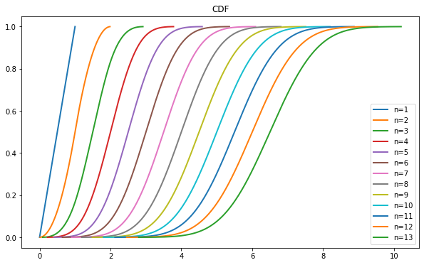

UniformSumDistribution
===========

A  implementation of the Irwin-Hall (the uniform sum) distribution - https://randomservices.org/random/special/IrwinHall.html

How to use
----------

Install it from pip (depends on scipy and numpy)

```python
pip install UniformSumDistribution
```

The package provides one class called ``UniformSumDistribution``, which implements the distribution.

```python
from UniformSumDistribution import UniformSumDistribution

distribution = UniformSumDistribution(n)
```
the ``distribution`` object has methods:

- ``rvs(size=1, *args, **kwds)`` - Random variates of given type.
- ``pdf(x, *args, **kwds)`` - Probability density function at x of the given RV.
- ``logpdf(x, *args, **kwds)`` - Log of the probability density function at x of the given RV.
- ``cdf(x, *args, **kwds)`` - Cumulative distribution function of the given RV.
- ``logcdf(x, *args, **kwds)`` - Log of the cumulative distribution function at x of the given RV.
- ``sf(x, *args, **kwds)`` - Survival function (1 - cdf) at x of the given RV.
- ``logsf(x, *args, **kwds)`` - Log of the survival function of the given RV.
- ``ppf(q, *args, **kwds)`` - Percent point function (inverse of cdf) at q of the given RV.
- ``isf(q, *args, **kwds)`` - Inverse survival function (inverse of sf) at q of the given RV.
- ``moment(n, *args, **kwds)`` - n-th order non-central moment of distribution.
- ``stats(*args, **kwds)`` - Some statistics of the given RV.
- ``entropy(*args, **kwds)`` - Differential entropy of the RV.
- ``expect([func, args, loc, scale, lb, ub, …])`` - Calculate expected value of a function with respect to the distribution by numerical integration.
- ``median(*args, **kwds)`` - Median of the distribution.
- ``mean(*args, **kwds)`` - Mean of the distribution.
- ``std(*args, **kwds)`` - Standard deviation of the distribution.
- ``var(*args, **kwds)`` - Variance of the distribution.
- ``interval(alpha, *args, **kwds)`` - Confidence interval with equal areas around the median.
- ``__call__(*args, **kwds)`` - Freeze the distribution for the given arguments.
- ``fit(data, *args, **kwds)`` - Return estimates of shape (if applicable), location, and scale parameters from data.
- ``fit_loc_scale(data, *args)`` - Estimate loc and scale parameters from data using 1st and 2nd moments.
- ``nnlf(theta, x)`` - Negative loglikelihood function.
- ``support(*args, **kwargs)`` - Support of the distribution.

Read more 
- ``scipy.stats.rv_continuous`` - https://docs.scipy.org/doc/scipy/reference/generated/scipy.stats.rv_continuous.html?highlight=rv_continuous
- ``Continuous Statistical Distributions`` - https://docs.scipy.org/doc/scipy/tutorial/stats/continuous.html#continuous-distributions-in-scipy-stats

Usage example
----------


```python
size = 8196
# Build PDF
plt.figure(figsize=(10, 6))
for n in range(1, 14):
    distribution = UniformSumDistribution(n)

    start = distribution.ppf(0.0001)
    end = distribution.ppf(0.9999)

    x = np.linspace(start, end, size)
    y = distribution.pdf(x)
    pdf = pd.Series(y, x)

    ax = pdf.plot(kind = 'line', label = 'n=%s' % n, legend = True, lw = 2)
    ax.set_title('PDF')
```


```python
# Build CDF
plt.figure(figsize=(10, 6))
for n in range(1, 14):
    distribution = UniformSumDistribution(n)

    start = distribution.ppf(0.0001)
    end = distribution.ppf(0.9999)

    x = np.linspace(start, end, size)
    y = distribution.cdf(x)
    cdf = pd.Series(y, x)

    ax = cdf.plot(kind = 'line', label = 'n=%s' % n, legend = True, lw = 2)
    ax.set_title('CDF')
```


```python
distribution = UniformSumDistribution(n = 2)
mean, variance, skew, kurtosis = distribution.stats(moments = 'mvsk')
mean, variance, skew, kurtosis
```
[out]: (array(1.), array(0.16666667), array(0.), array(-0.6))

```python
size = 5000
bins = 32
n = 2
distribution = UniformSumDistribution(n = n)

# Get start and end points of distribution
start = distribution.ppf(0.0001)
end = distribution.ppf(0.9999)

# Build PDF
x = np.linspace(start, end, size)
y = distribution.pdf(x)
pdf = pd.Series(y, x)

# Create random data
rv = pd.Series(distribution.rvs(size = size))

# Get histogram of random data
b = np.linspace(start, end, bins + 1)
y, x = np.histogram(rv, bins = b, density = True)
x = [(a + x[i + 1]) / 2.0 for i, a in enumerate(x[0:-1])]
hist = pd.Series(y, x)

w = abs(abs(hist.index[0]) - abs(hist.index[1]))

plt.figure(figsize=(10, 6))
ax = pdf.plot(kind = 'line', label = 'PDF', legend = True, lw = 2, color = 'r')
ax.bar(hist.index, hist.values, label = 'Random Sample', width = w, alpha = 0.5, color = 'c')
legend = plt.legend()
```


License
-------

Copyright (c) 2022 Artyom Zolotarevskiy.

**UniformSumDistribution** is free software made available under the MIT License. For
details see the LICENSE file.

[](https://github.com/j-faria/Kumaraswamy/blob/master/LICENSE)
